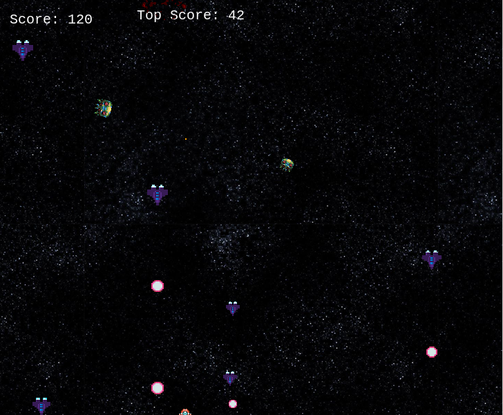

# SHOOTER GAME

This project is an RPG shooter game built with Phaser 3, a JavaScript game framework designed to create 2D games

## Built With
- Phaser 3
- Webpack
- Leaderboard API service
- PostMan
- JavaScript
- Jest
- Webpack
- HTML & CSS

## How To Play
- Drive the shooter jet with your keyboard arrows.
- Press keys A, W, S, D to move left, up, down and right
- Use the spacebar to shoot the invaders enemy to gain points.

- Avoid getting shot or colliding with the enemy.

## Getting Started
To get a copy up and running follow these simple example steps:-

- Clone https://github.com/okikiola11/js-shooter-rpg.git to your local machine.
- Run npm install
- npm start

## Loading Screen

### Menu Screen

### Options Screen

### Game Screen

## Game Development

### Day 0
- I spent the first day after requesting for my project reading the requirements and watching tutorials. I set up my repository, configured the webpack and gathered the spritesheet images, background and music for the project. By the end of the day, I had a shell of the game I wanted to create.

### Weekend:
- I planned to start implementing the logic, however I realized I needed deeper understanding of how to approach the project.

### Day 1
- I started implementing game logic (preloader, title, game over, etc.). I still got a blocker from uploading the spritesheet image which delayed my progress but I continued working

### Day 2 
- Continued with the implementation, created the modules, the screens, the objects. I made more progress writing the logic spawning the enemies, created the player etc

### Live Demo
<a href="">Click here

## Author
 Okikiola Apelehin

- Github: [@okikiola11](https://github.com/okikiola11)
- Twitter: [@Kikiolla3](https://twitter.com/Kikiolla3)
- Linkedin: [@okikiola-apelehin](https://www.linkedin.com/in/okikiola-apelehin-459008122/)

## 🤝 Contributing

Contributions, issues and feature requests are welcome!

Feel free to check the [issues page](https://github.com/okikiola11/js-shooter-rpg/issues).

## Show your support

Give a ⭐️ if you like this project!

## Acknowledgments

- <a href="https://google.com">Google</a>
- Microverse

## 📝 License

This project is [MIT](lic.url) licensed.